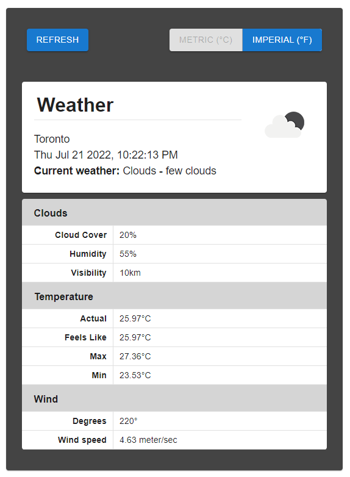

# React/Redux Weather App

A simple weather app built using React & Redux. Display weather data based on the user's current location and switch between metric and imperial units.

## How to Run

### 1. Download [GraphQL Wrapper for the Open Weather Map API](https://github.com/konstantinmuenster/graphql-weather-api)

Follow the installation instructions [here](https://github.com/konstantinmuenster/graphql-weather-api/blob/master/README.md#how-to-install) and start the server.

### 2. In this project's directory, run:
```sh
npm install
npm start
```

Open [http://localhost:3000](http://localhost:3000) to view in browser.

## Demo
<div align="center">
  
</div>
